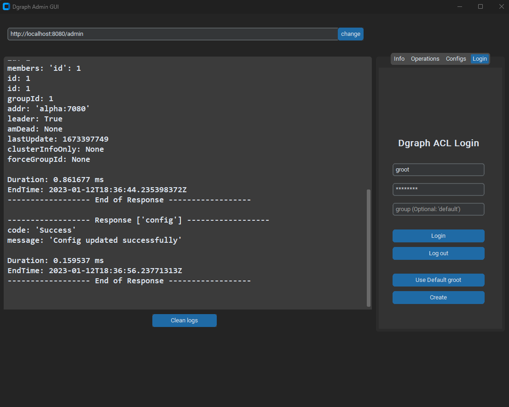

# AdminGUI



AdminGUI is a Graphical User Interface (GUI) for executing procedures on a Dgraph cluster. It allows users to perform the following actions:

* **Group management**: Create, update, and delete groups for the Dgraph system's Access Control List (ACL).
* **Namespace management**: Create, update, and delete namespaces within Dgraph.
* **User management**: Create, update, and delete users and link them to a group.
* **Cluster configuration**: Use the Dgraph GraphQL API's config mutation to alter the amount of RAM cache used in the cluster, as well as other values such as log verbosity.
* **Enterprise license**: Introduce an enterprise license for the cluster.
* **Node management**: Use the removeNode mutation to remove a node from the cluster's RAFT context.
* **Cluster state**: Use the state query to view the current state of the cluster.
* **Authentication**: Use the login mutation to authenticate with the ACL.

When the user performs any of the functions in the GUI, a text field will appear with the response of the query. Whether it was successful or not.

## Dev

Run the following commands to setup the development environment:

pipreqs.

pip install -r requirements.txt

### Run

To execute the code:

* Make sure you have the necessary dependencies installed.
* Run `py .` in the command line in the root directory of the project.
* You can also set arguments and pass default values as command line arguments. You can check the available args using `py . -h`.

e.g.
```
py . --hostname http://localhost:8080/admin --username lucas --password password
```
